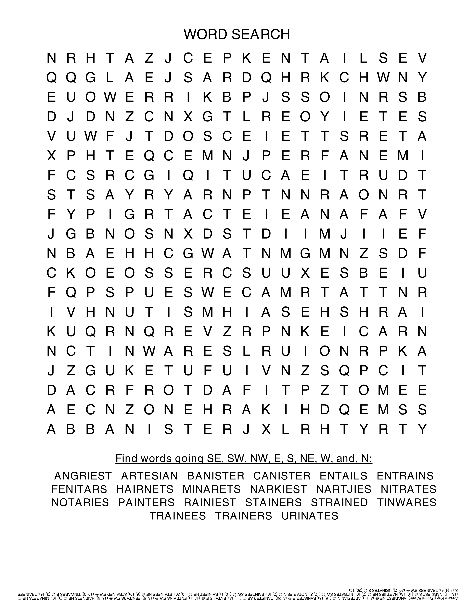
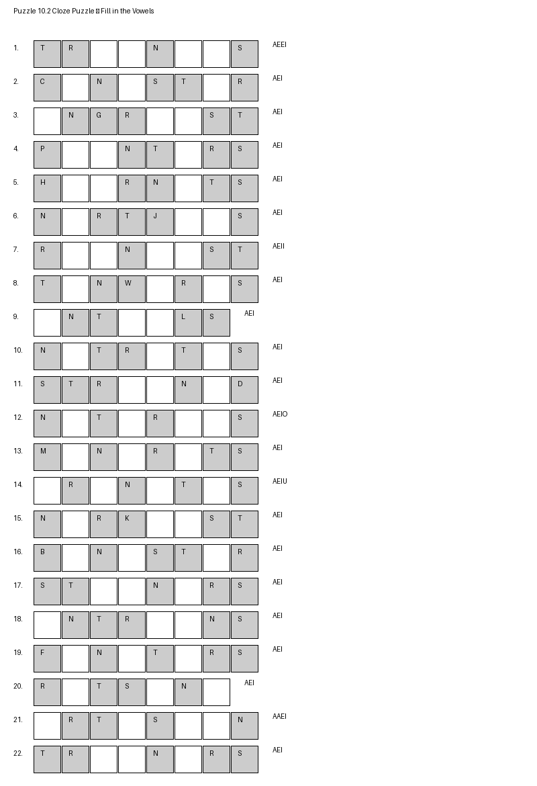
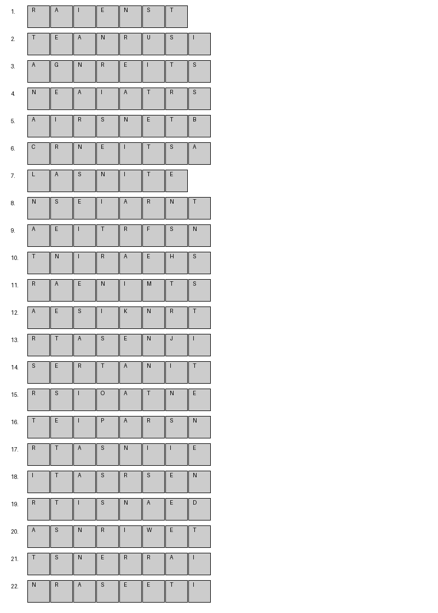

# Chapter 10 — Strategy Deep Dive: The AEINST Anagram Family

Welcome to our most advanced strategy chapter. Here, we move beyond themed words to explore a concept that is a true force multiplier in Countdown: **deep anagram families**.

The six letters **A, E, I, N, S, T** are some of the most common in English. When they appear together, they form the foundation for a huge number of 7- and 8-letter words. By adding just one or two extra letters to this core set, you can unlock dozens of high-scoring plays.

In this chapter, we'll start with two key 7-letter words, **ATONIES** and **RETSINA**, and then explore the massive family of 8-letter words that can be built from their letters. Mastering this group will train you to see not just one word, but a whole universe of possibilities in a letter selection.

---

## Word List and Meanings

**AEINST**
The 6-letter root of this powerful anagram family.

**ATONIES**
A medical term for a lack of muscular tone. One of the key 7-letter words.

**RETSINA**
A type of Greek wine. The other key 7-letter word in this family.

**URINATES**
The jumping off word for this chapter's theme. To go for a wee.

**ARTESIAN**

**BANISTER**

**CANISTER**

**ENTAILS**

**ENTRAINS**

**FENITARS**: a plant once used to treat scurvy

**HAIRNETS**

**MINARETS**

**NARKIEST**

**NARTJIES**: another name for tangerines
**NITRATES**

**NOTARIES**

**PAINTERS**

**RAINIEST**

**STAINERS**

**STRAINED**

**TINWARES**: objects made of tin.

**TRAINEES**

**TRAINERS**

---

## Games

### 10.1 Word Search Grid

Find all 8 words from the RETSINA family in this grid.

### 10.2 Cloze Recognition

Fill in the vowels to reconstruct the anagrams.

### 10.3 Letters Round Recognition

Unscramble the letters to find each of the 8 target words.

---

**Tip**: The core letters to look for are **A, E, I, N, R, S, T**. When you see these on the board, start thinking about what eighth letter could complete a word.

Next: Chapter 11 will return to themed words, focusing on terms related to time and history. 