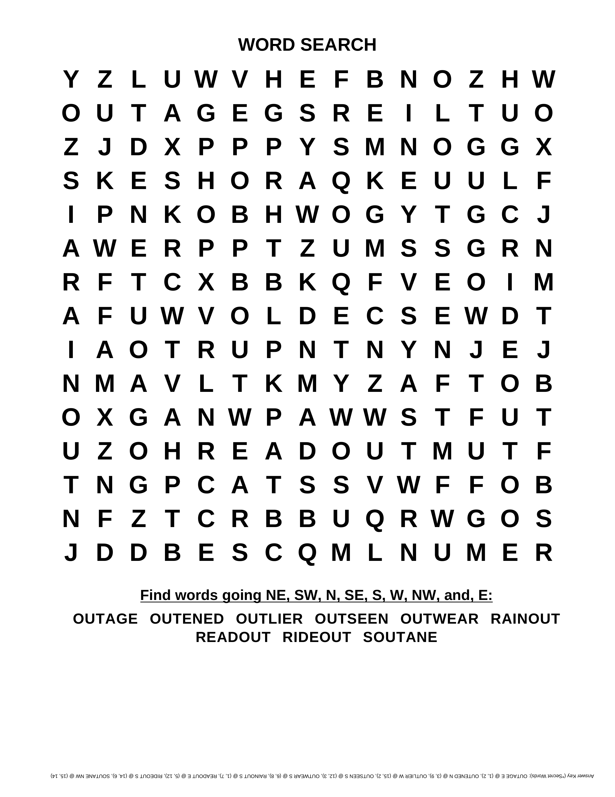
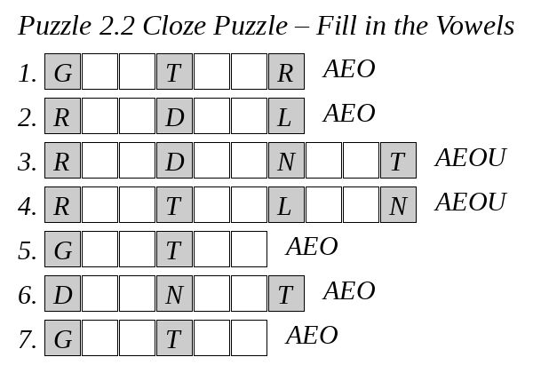
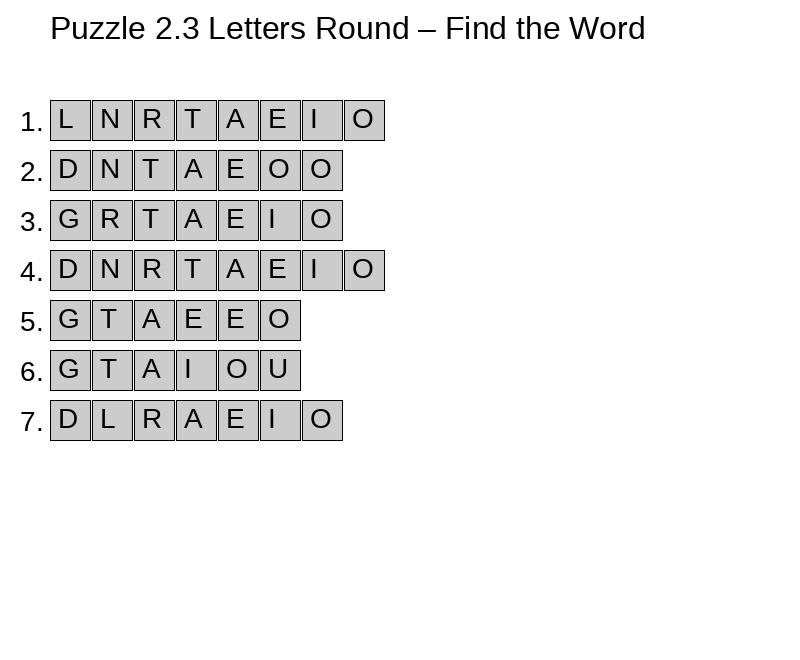
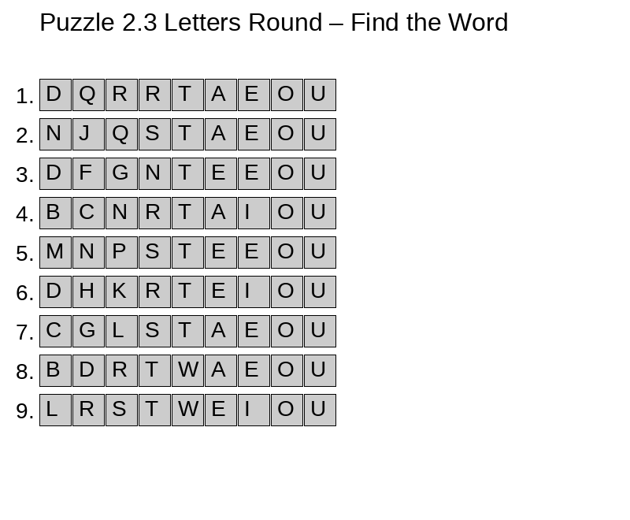

# Chapter 2 — Animals in Disguise

In this chapter, we explore 8 words that relate to animals. Some of these words may appear obscure at first glance, but they are all valid and common enough to show up in a Countdown game. Understanding their meanings can help build memory hooks, while the shared animal theme makes them easier to group together in your mind.

---

## Word List and Meanings

**AGOUTI**  
Agile long-legged rabbit-sized rodent of Central and South America. Valued as food. Plural is Agoutis

**GOATEE**  
A small chin beard trimmed to a point; named for its resemblance to a goat's beard. Plural is goatees.

**GOATIER**  
Comparative form of "goaty". A Countdown-valid word even if never used in daily speech.

**ODONATE**  
A large primitive predatory aquatic insect with two pairs of membranous wings. Related to dragonflies. Odonates is the plural.

**RADIOLE**  
A bristle-like organ found in marine animals like sea urchins.

**RODENTIA**  
The order of small gnawing animals like porcupines, mice, squirrels, and guinea pigs. Includes the agouti. Rodentian and rodential are valid words meaning related to rodents.

**SNOUTED**
Having a snout or a projecting nose or mouth, as in some animals.

**LADINOS**
Plural of Ladino; refers to people of mixed European and indigenous ancestry, especially in Latin America, or to speakers of Judeo-Spanish.

**SALTINE**
A thin, crisp, salted cracker.

**SARDINE**
A small, oily fish often canned for food.

**DOGEARS**
Plural of dogear; the turned-down corners of pages in a book, or to fold down such a corner.

**PORGIES**
Plural of porgy; a type of fish found in coastal waters.

**NUTRIAS**
Plural of nutria; large, semi-aquatic rodents also known as coypu.

---

## Games

### 2.1 Word Search Grid

Hunt down all animal words in this themed puzzle.

{ width=100% }

### 2.2 Cloze Recognition

This game removes the vowels from the words you've just seen. Can you reconstruct them using only the consonants and vowel clues?
These puzzles will get more difficult as you get experience.

{ width=120% }

### 2.3 Letters Round Recognition

Reconstruct each of todays new words.

{ width=120% }

---

### Review: Yesterday's Words

Can you still recall the words from Chapter 1? Try solving them again. Now with 9 letters like the real game.

{ width=120% }

---

Next: Chapter 3 will introduce words with vivid adjectives—describing qualities, appearances, or textures.
