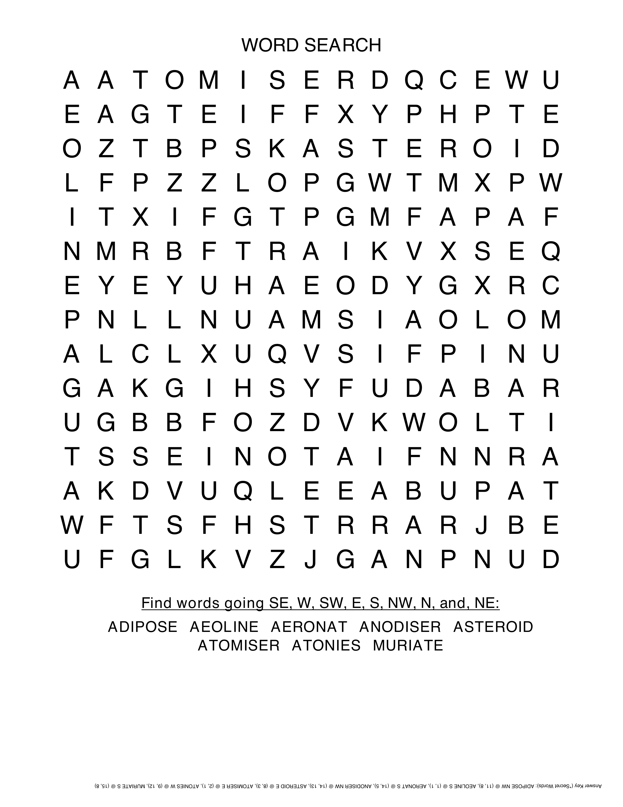
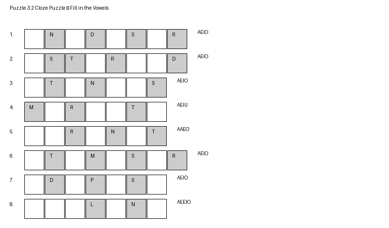
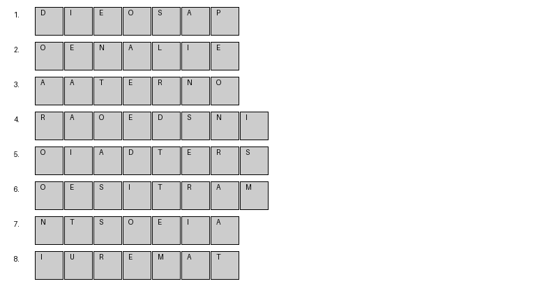

# Chapter 3 — Medical and Scientific Terms (Part 1)

In this chapter, we explore 8 valid Countdown words drawn from medicine and science. Many of these words appear in technical contexts but are still valid under standard word lists. Learning them offers an advantage when scientific-looking letter clusters appear.

---

## Word List and Meanings

**ADIPOSE**
Composed of animal fat. Common in biological and medical descriptions. Adiposes is the allowed plural.

**AEOLINE**
Carried by the wind. Related to Aeolus, the god of wind. Often used in geology.

**AERONAT**
A balloonist or airship pilot. Outdated and would now be called and Aeronaut. 

**ANODISER**
One who makes an anode. Common in industrial or electrochemical contexts.

**ASTEROID**
A rocky or metallic celestial body orbiting the sun, typically between Mars and Jupiter. Plural is asteroids

**ATOMISER**
A device that turns liquid into a fine mist, such as for perfume or medication. atomises and atomised and anatomised are also valid. 

**MURIATE**
To pickle or preserve in brine. Historically used in chemistry (e.g., muriatic acid). Muriated and Muriates are two derived words.

---

## Games

### 3.1 Word Search Grid

Find all 8 words hidden in a puzzle.

### 3.2 Cloze Challenge

This puzzle reinforces the science and medicine theme. Clues are rewritten for deeper recall.

{width = 150%}

### 3.3 Letters Round Recognition

Now puzzles closer to the ones in Countdown. Write your answers on the side. You can check back to the chapters word list if you are stuck.

{width = 150%}

---

**Tip**: Scientific words often have Greek or Latin roots. If you learn parts like `-oid`, `aero-`, or `-ise`, you gain access to whole families of related terms.

Next: Chapter 4 will bring in descriptive adjectives to help you recognize and build vivid words quickly.
